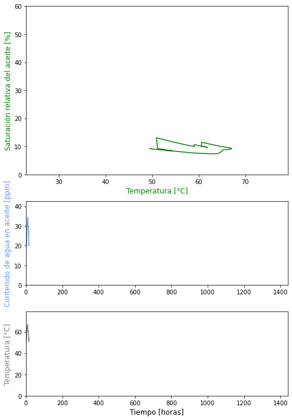

dyn-H2PO
========
dynamics of water (H2O) in Paper-Oil insulation

This repository contains a time-dependent model to simulate the water content dynamics in cellulose-oil insulation. The model considers the diffusion of water in cellulose as if it were a single time constant (for small thicknesses). Only mineral oil is considered.

Overview
---------
Key features:

* Simulate the water content dynamics in cellulose-oil insulation over time
* Consider the temperature to which the insulation is subjected at each time step
* Simplified simulation that considers water diffusion in cellulose as a single time constant
* Only mineral oil is considered
* Use different types of cellulose (kraft paper or pressboard)
* Use different conditions of cellulose (new or aged)
* Include different qualities of dielectric oil modeled with oil acidity [mg KOH/g]
* Include different types of oil modeled with aromatic content [%]
* Use oil-cellulose water content relative saturation equilibrium curves

## Example of simulation
The next gif is generated with matplotlib with a simulation resulted of using this model. 
The modeled insulation it has the next characteristics:
- initial cellulose water content: 2.2%
- Pressboard cellulose 
- Condition cellulose: aged
- Oil Acidity: 0.05 mg KOH/g
- Oil Aromatic content: 15%

## References:
This code and model are based on the following literature:
* 2008 - Koch, M. - "RELIABLE MOISTURE DETERMINATION IN POWER TRANSFORMERS" - Doctorate Thesis
* 2016 - Przybylek, P. - "Water Saturation Limit of Insulating Liquids and Hygroscopicity of Cellulose in Aspect of Moisture Determination in Oil-Paper Insulation" - IEEE Transactions on Dielectrics and Electrical Insulation - Vol 23, No 3
* 2018 - Cigre Brochure 741 - "Moisture measurement and assessment in transformer insulation - Evaluation of chemical methods and moisture capacitive sensors"
* 2013 - García, D.F. - "Determination of moisture diffusion coefficient for oil-impregnated Kraft-paper insulation" - Electrical Power and Energy Systems 53 - Elseiver

## Note
To obtain functional models as required, curve fitting of many curves published in the references was necessary. The code to perform these curve fittings is not included here at this time.

## License:

This repository is licensed under the GNU GPLv3.

## Contact:

If you have any questions, please contact:

luloenciso@gmail.com 

www.linkedin.com/in/luciano-enciso

I hope this is helpful! Let me know if you have any other questions.

